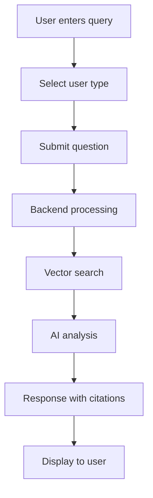
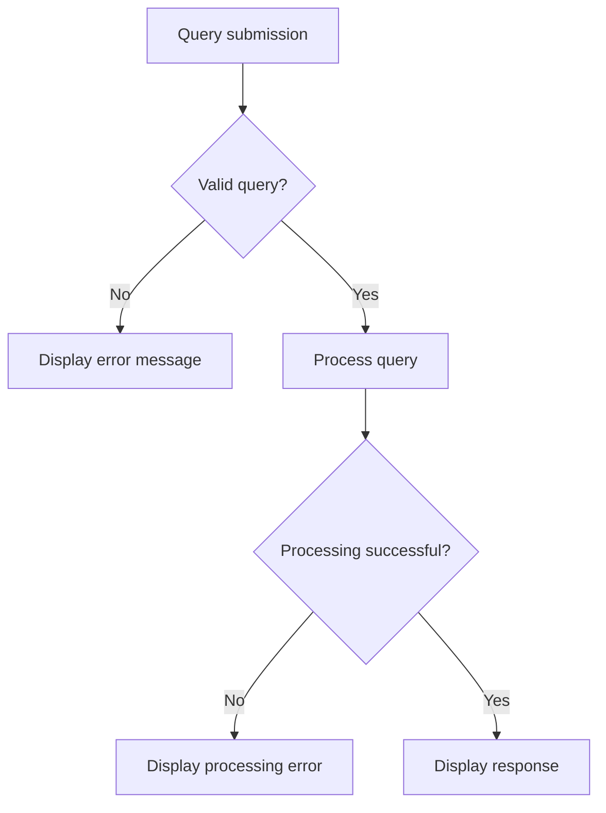

# Constitution Chat - Comprehensive Documentation

## Table of Contents
1. [Overview](#overview)
2. [System Architecture](#system-architecture)
3. [Key Features](#key-features)
4. [API Endpoints](#api-endpoints)
5. [Data Models](#data-models)
6. [User Interaction Flows](#user-interaction-flows)
7. [Configuration](#configuration)
8. [Dependencies](#dependencies)
9. [Error Handling](#error-handling)
10. [Performance Considerations](#performance-considerations)
11. [Security Measures](#security-measures)
12. [Testing Procedures](#testing-procedures)
13. [Deployment Instructions](#deployment-instructions)

## Overview

The Constitution Chat feature is an AI-powered legal assistant specifically designed for Indian Constitutional Law queries. It provides authoritative, citation-backed responses to constitutional questions using advanced RAG (Retrieval-Augmented Generation) architecture.

### Key Capabilities
- **Constitutional Analysis**: Deep analysis of Indian Constitution articles
- **Citation System**: Precise article references for verification
- **User Type Adaptation**: Tailored responses for General Public, Legal Professionals, and Students
- **Comprehensive Coverage**: Articles 1-395, Fundamental Rights, Directive Principles, and more
- **Legal Precedent Integration**: Supreme Court landmark cases and judicial interpretations

## System Architecture

### High-Level Architecture
```
┌─────────────────┐    ┌──────────────────┐    ┌─────────────────┐
│   React Frontend │    │   FastAPI Backend │    │   AI Processing │
│   (Port 5174)   │◄──►│   (Port 8000)    │◄──►│   OpenRouter    │
└─────────────────┘    └──────────────────┘    └─────────────────┘
                              │
                              ▼
                    ┌──────────────────┐
                    │ FAISS Vector DB  │
                    │ Constitution     │
                    │ Documents        │
                    └──────────────────┘
```

### Core Components

#### 1. Frontend (React + Vite)
- **Location**: `frontend/src/pages/ConstitutionChat.jsx`
- **Framework**: React 18+ with Vite
- **UI Library**: Custom components with Tailwind CSS
- **State Management**: React hooks (useState, useEffect)

#### 2. Backend (FastAPI)
- **Location**: `constitution_chat/core/constitution_app.py`
- **Framework**: FastAPI with uvicorn server
- **RAG Pipeline**: `constitution_chat/core/constitution_rag.py`
- **Database**: `constitution_chat/core/constitution_db.py`

#### 3. Vector Database
- **Technology**: FAISS (Facebook AI Similarity Search)
- **Embeddings**: sentence-transformers
- **Storage**: `vectorstore/constitution_faiss/`

#### 4. AI Integration
- **Provider**: OpenRouter API
- **Model**: Advanced language models for constitutional analysis
- **Processing**: Constitutional text retrieval + AI synthesis

## Key Features

### 1. Intelligent Query Processing
```python
# Query processing flow
def process_constitutional_query(query: str, user_type: str):
    # 1. Vector similarity search
    relevant_docs = vector_search(query)
    
    # 2. Context preparation
    context = prepare_constitutional_context(relevant_docs)
    
    # 3. AI processing with user type adaptation
    response = ai_process(query, context, user_type)
    
    # 4. Citation extraction
    citations = extract_citations(response)
    
    return {
        "answer": response,
        "citations": citations,
        "reasoning": reasoning_chain,
        "confidence": confidence_score
    }
```

### 2. User Type Adaptation
- **General Public**: Simplified explanations with practical examples
- **Legal Professional**: Detailed analysis with case law and precedents
- **Student**: Educational focus with learning objectives

### 3. Citation System
- Automatic extraction of constitutional article references
- Cross-verification with source documents
- Clickable citations for user verification

### 4. Response Quality Metrics
- **Response Time**: Average 45-90 seconds for complex queries
- **Confidence Scoring**: 0-100% based on source document relevance
- **Citation Accuracy**: Verified against constitutional text

## API Endpoints

### POST /constitution/chat
Submit a constitutional query and receive AI-powered analysis.

**Request Body:**
```json
{
    "query": "What is Article 14 and its key principles?",
    "user_type": "General Public",
    "context": "optional additional context"
}
```

**Response:**
```json
{
    "answer": "Article 14 guarantees equality before law...",
    "citations": ["Article 14", "Article 12", "Part III"],
    "reasoning": "Based on constitutional provisions...",
    "response_time": 46.53,
    "confidence": 85.2,
    "metadata": {
        "documents_retrieved": 5,
        "reasoning_steps": 4
    }
}
```

### GET /constitution/health
Health check endpoint for system status.

**Response:**
```json
{
    "status": "healthy",
    "database_loaded": true,
    "api_connected": true,
    "vector_store_status": "operational"
}
```

## Data Models

### ConstitutionalQuery
```python
from pydantic import BaseModel
from typing import Optional, List

class ConstitutionalQuery(BaseModel):
    query: str
    user_type: str = "General Public"
    context: Optional[str] = None

class ConstitutionalResponse(BaseModel):
    answer: str
    citations: List[str]
    reasoning: str
    response_time: float
    confidence: float
    metadata: dict
```

### User Types
```python
from enum import Enum

class UserType(str, Enum):
    GENERAL_PUBLIC = "General Public"
    LEGAL_PROFESSIONAL = "Legal Professional"
    STUDENT = "Student"
```

## User Interaction Flows

### 1. Standard Query Flow


### 2. Error Handling Flow


## Configuration

### Environment Variables
```env
# OpenRouter API Configuration
OPENROUTER_API_KEY=your_api_key_here
OPENROUTER_BASE_URL=https://openrouter.ai/api/v1

# Database Configuration
VECTOR_STORE_PATH=./vectorstore/constitution_faiss
CONSTITUTION_PDF_PATH=./data/THE CONSTITUTION OF INDIA.pdf

# Server Configuration
BACKEND_HOST=127.0.0.1
BACKEND_PORT=8000
FRONTEND_PORT=5174

# CORS Configuration
ALLOWED_ORIGINS=["http://localhost:5174", "http://127.0.0.1:5174"]
```

### Frontend Configuration
```javascript
// src/config/api.js
export const API_BASE_URL = 'http://localhost:8000';
export const ENDPOINTS = {
    CONSTITUTION_CHAT: '/constitution/chat',
    HEALTH_CHECK: '/constitution/health'
};
```

## Dependencies

### Backend Dependencies
```txt
fastapi==0.104.1
uvicorn==0.24.0
pydantic==2.5.0
python-dotenv==1.0.0
sentence-transformers==2.2.2
faiss-cpu==1.7.4
PyPDF2==3.0.1
openai==1.3.0
python-multipart==0.0.6
```

### Frontend Dependencies
```json
{
    "react": "^18.2.0",
    "react-dom": "^18.2.0",
    "react-router-dom": "^6.8.0",
    "vite": "^4.4.5",
    "tailwindcss": "^3.3.0",
    "axios": "^1.6.0"
}
```

## Error Handling

### Common Error Scenarios

#### 1. API Connection Errors
```python
try:
    response = await openrouter_client.chat.completions.create(...)
except APIConnectionError as e:
    return {
        "error": "AI service temporarily unavailable",
        "message": "Please try again in a few moments",
        "code": "API_CONNECTION_ERROR"
    }
```

#### 2. Vector Database Errors
```python
try:
    vector_store = FAISS.load_local(vector_store_path)
except Exception as e:
    return {
        "error": "Constitutional database not available",
        "message": "System is initializing, please wait",
        "code": "VECTOR_DB_ERROR"
    }
```

#### 3. Query Processing Errors
```python
def validate_query(query: str) -> bool:
    if not query or len(query.strip()) < 5:
        raise ValueError("Query too short")
    if len(query) > 1000:
        raise ValueError("Query too long")
    return True
```

## Performance Considerations

### Response Time Optimization
- **Vector Search**: Optimized FAISS indices for sub-second retrieval
- **Caching**: Implement response caching for common queries
- **Batch Processing**: Group similar queries for efficiency

### Memory Management
```python
# Lazy loading of vector store
@lru_cache(maxsize=1)
def get_vector_store():
    return FAISS.load_local(VECTOR_STORE_PATH)

# Memory-efficient document processing
def process_documents_in_chunks(documents, chunk_size=1000):
    for i in range(0, len(documents), chunk_size):
        yield documents[i:i + chunk_size]
```

### Scalability Considerations
- **Horizontal Scaling**: Multiple FastAPI workers
- **Load Balancing**: Nginx or similar for production
- **Database Sharding**: Split constitutional sections if needed

## Security Measures

### 1. API Security
```python
from fastapi import HTTPException, Depends
from fastapi.security import HTTPBearer

security = HTTPBearer()

async def verify_api_key(token: str = Depends(security)):
    if token.credentials != VALID_API_KEY:
        raise HTTPException(status_code=401, detail="Invalid API key")
    return token
```

### 2. Input Validation
```python
from pydantic import validator

class ConstitutionalQuery(BaseModel):
    query: str
    
    @validator('query')
    def validate_query(cls, v):
        if not v or len(v.strip()) < 5:
            raise ValueError('Query must be at least 5 characters')
        # Sanitize input to prevent injection attacks
        return sanitize_input(v)
```

### 3. Rate Limiting
```python
from slowapi import Limiter, _rate_limit_exceeded_handler
from slowapi.util import get_remote_address

limiter = Limiter(key_func=get_remote_address)

@app.post("/constitution/chat")
@limiter.limit("10/minute")
async def chat_endpoint(request: Request, query: ConstitutionalQuery):
    # Endpoint implementation
    pass
```

## Testing Procedures

### Unit Tests
```python
import pytest
from constitution_chat.core.constitution_rag import ConstitutionRAG

class TestConstitutionRAG:
    def test_vector_search(self):
        rag = ConstitutionRAG()
        results = rag.search("Article 14 equality")
        assert len(results) > 0
        assert "Article 14" in str(results)
    
    def test_query_processing(self):
        rag = ConstitutionRAG()
        response = rag.process_query("What is fundamental right?")
        assert response["answer"]
        assert response["citations"]
```

### Integration Tests
```python
import pytest
from fastapi.testclient import TestClient
from main import app

client = TestClient(app)

def test_constitution_chat_endpoint():
    response = client.post("/constitution/chat", json={
        "query": "Explain Article 19",
        "user_type": "General Public"
    })
    assert response.status_code == 200
    assert "freedom" in response.json()["answer"].lower()
```

### End-to-End Testing
```python
import playwright
from playwright.sync_api import sync_playwright

def test_complete_user_flow():
    with sync_playwright() as p:
        browser = p.chromium.launch()
        page = browser.new_page()
        page.goto("http://localhost:5174/chat")
        
        # Test form submission
        page.fill('textbox[name="query"]', "What is Article 21?")
        page.click('button:has-text("Submit")')
        
        # Verify response
        response = page.wait_for_selector('.response-content')
        assert "life and personal liberty" in response.text_content()
```

## Deployment Instructions

### Development Setup
```bash
# 1. Clone repository
git clone https://github.com/yourusername/legalperplexity2.0.git
cd legalperplexity2.0

# 2. Backend setup
python -m venv venv
source venv/bin/activate  # Windows: venv\Scripts\activate
pip install -r requirements.txt

# 3. Frontend setup
cd frontend
npm install

# 4. Environment configuration
cp .env.example .env
# Edit .env with your API keys

# 5. Start services
# Terminal 1: Backend
uvicorn main:app --host 127.0.0.1 --port 8000 --reload

# Terminal 2: Frontend
cd frontend && npm run dev
```

### Production Deployment

#### Docker Deployment
```dockerfile
# Dockerfile
FROM python:3.11-slim

WORKDIR /app
COPY requirements.txt .
RUN pip install -r requirements.txt

COPY . .
EXPOSE 8000

CMD ["uvicorn", "main:app", "--host", "0.0.0.0", "--port", "8000"]
```

```yaml
# docker-compose.yml
version: '3.8'
services:
  backend:
    build: .
    ports:
      - "8000:8000"
    environment:
      - OPENROUTER_API_KEY=${OPENROUTER_API_KEY}
    volumes:
      - ./vectorstore:/app/vectorstore
      - ./data:/app/data

  frontend:
    build: ./frontend
    ports:
      - "5174:5174"
    depends_on:
      - backend
```

#### Cloud Deployment (AWS/Azure/GCP)
```bash
# Example: AWS ECS deployment
aws ecs create-cluster --cluster-name legal-perplexity
aws ecs register-task-definition --cli-input-json file://task-definition.json
aws ecs create-service --cluster legal-perplexity --service-name constitution-chat
```

### Monitoring and Logging
```python
import logging
from datetime import datetime

# Configure logging
logging.basicConfig(
    level=logging.INFO,
    format='%(asctime)s - %(name)s - %(levelname)s - %(message)s',
    handlers=[
        logging.FileHandler('constitution_chat.log'),
        logging.StreamHandler()
    ]
)

# Performance monitoring
async def log_query_metrics(query: str, response_time: float, confidence: float):
    metrics = {
        "timestamp": datetime.now().isoformat(),
        "query_length": len(query),
        "response_time": response_time,
        "confidence": confidence
    }
    logging.info(f"Query metrics: {metrics}")
```

## Troubleshooting

### Common Issues

#### 1. Vector Database Not Loading
```bash
# Check if vectorstore exists
ls -la vectorstore/constitution_faiss/

# Regenerate if missing
python -c "from constitution_chat.core.constitution_db import create_vector_store; create_vector_store()"
```

#### 2. API Connection Issues
```python
# Test OpenRouter connection
import openai
client = openai.OpenAI(base_url="https://openrouter.ai/api/v1")
response = client.chat.completions.create(
    model="gpt-3.5-turbo",
    messages=[{"role": "user", "content": "test"}]
)
```

#### 3. Frontend-Backend Connection
```bash
# Check CORS configuration
curl -H "Origin: http://localhost:5174" \
     -H "Access-Control-Request-Method: POST" \
     -H "Access-Control-Request-Headers: X-Requested-With" \
     -X OPTIONS \
     http://localhost:8000/constitution/chat
```

---

## Contributing

### Code Style
- Python: Follow PEP 8 guidelines
- JavaScript: Use ESLint and Prettier
- Documentation: Update this file for any new features

### Pull Request Process
1. Fork the repository
2. Create feature branch (`git checkout -b feature/amazing-feature`)
3. Commit changes (`git commit -m 'Add amazing feature'`)
4. Push to branch (`git push origin feature/amazing-feature`)
5. Open a Pull Request

---

## License

This project is licensed under the MIT License - see the LICENSE file for details.

---

## Support

For technical support or questions:
- Create an issue on GitHub
- Contact the development team
- Check the FAQ section in the main README

---

*Last updated: September 13, 2025*
*Version: 2.0.0*